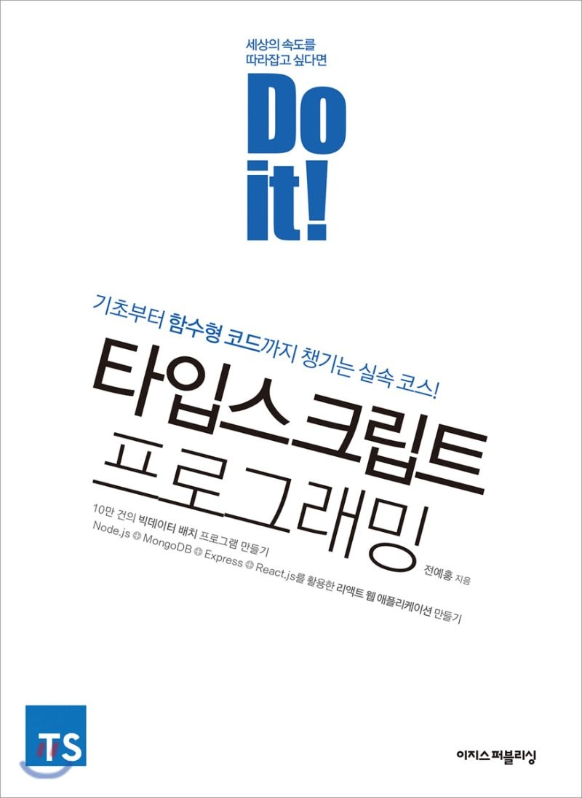
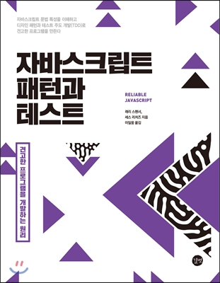
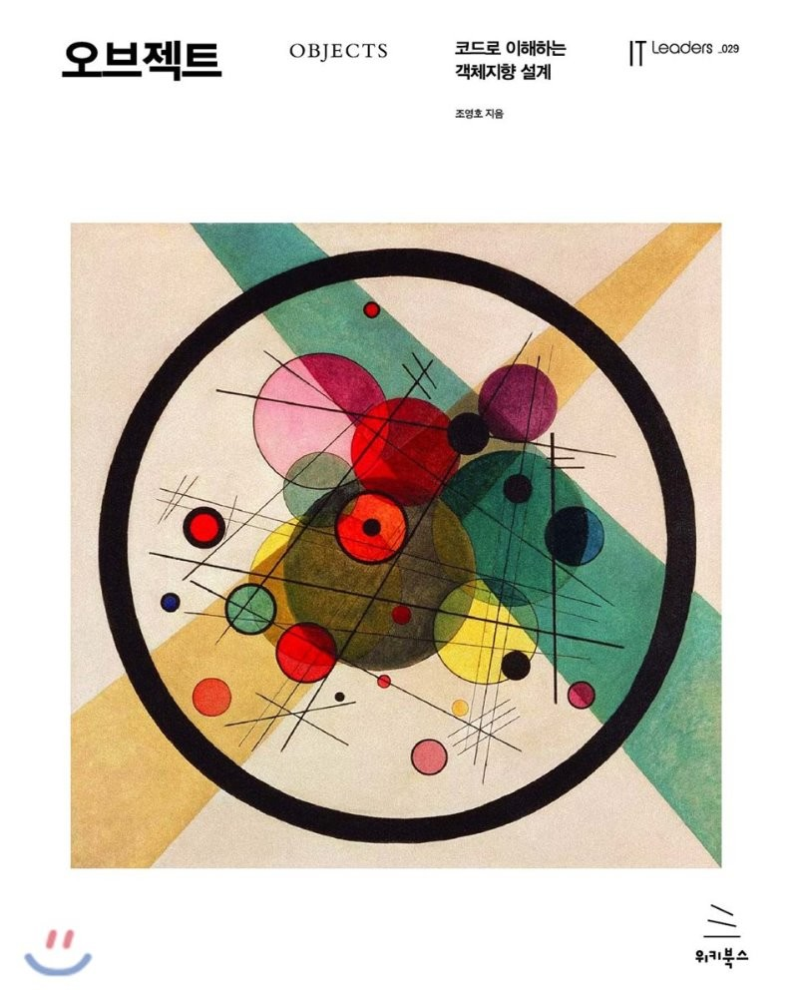

# 👉 Summarize books
- 스터디를 통해 책을 읽고 정리하며 공부합시다! 💻

### 📚 스터디를 진행한 책
#### 기간 내에 정해진 분량의 책을 읽고 스터디를 진행합니다.

|[**Do it! 타입스크립트 프로그래밍**](https://github.com/Fortuna-Study/learning-typescript)|**자바스크립트 패턴과 테스트**|**오브젝트**|
|:---:|:---:|:---:|
||||
